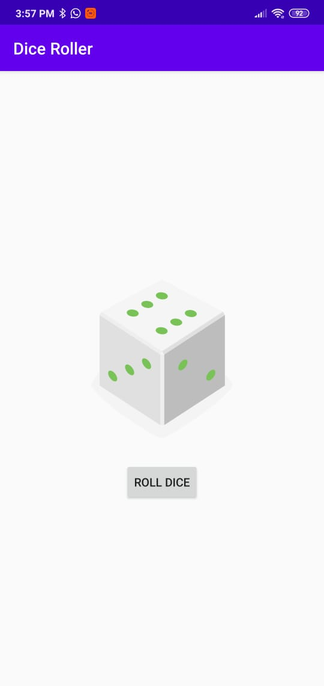
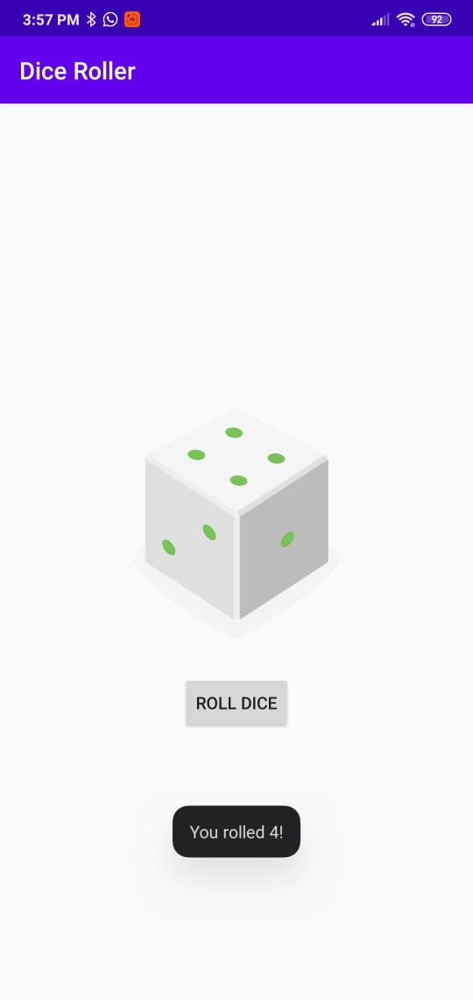

# Kotlin Playground
Small apps to get started and learn more about Android with Kotlin. 

## Dice Roller - Beginner
Simple dice roll app

Good app to get started. Basic concepts such as Activity, folder structure, vectorDrawables in gradle, lateinit variables and XML tools namespace.

    
    

## References

[Udacity course](https://classroom.udacity.com/courses/ud9012)